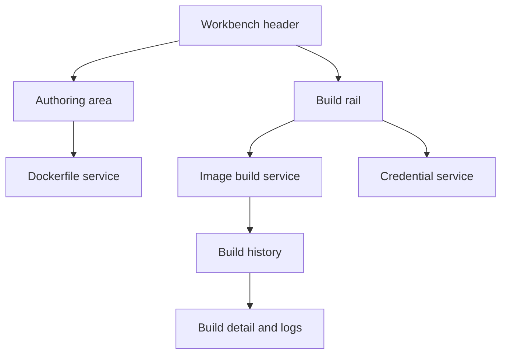

# Docker Image Builder Workbench Refresh

Feature Name: docker-image-builder-workbench-refresh
Updated: 2026-07-31

## Description

Refresh `DockerfileImageBuilderWidget` into a responsive workbench that
groups Dockerfile authoring, build delivery, credentials, build history, and
build output without changing its service contracts.

## Architecture

## Components and Interfaces

- `DockerfileImageBuilderWidget` retains its existing React state and service
  calls. The returned JSX gains semantic sections and dedicated class names
  for the header, authoring area, build rail, credentials, history, and logs.
- `style/index.css` provides theme-variable driven layout, card, status badge,
  selected-history, and responsive styles.

## Data Models

The refresh introduces no persisted data or API changes. Existing
`IImageBuild`, `IImageBuildLogEntry`, and `IRegistryCredentialSummary` values
continue to populate the interface.

## Correctness Properties

1. All existing controls retain their service action and accessible label.
2. The primary build action remains disabled when image reference is empty or
   history refresh is active.
3. The selected build remains the source of build status, actions, and logs.

## Error Handling

Existing service errors continue through `RequestErrors.serverError`; the
layout does not alter error propagation.

## Test Strategy

- Preserve the existing React tests for credential creation, build submission,
  selected build logs, and Runtime Image registration.
- Add assertions for the workbench regions, selected history affordance, and
  build status badges.
