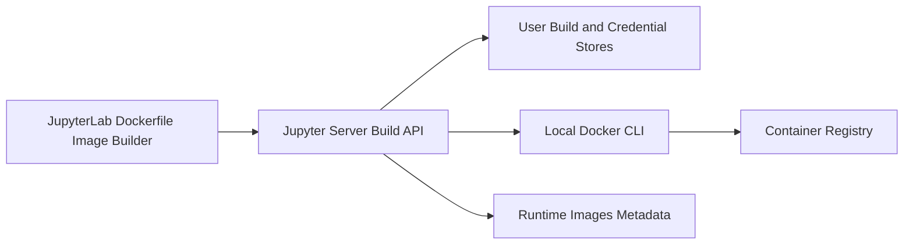

# Dockerfile Image Builder

Feature Name: dockerfile-image-builder
Updated: 2026-07-30

## Description

该功能在 Runtime Images 管理体验中增加镜像构建工作台。用户选择或创建工作区 Dockerfile，编辑后由 Jupyter Server 主机的 Docker CLI 构建镜像。构建成功的镜像可推送到管理员默认仓库或用户个人仓库，并登记到现有 Runtime Images Metadata。

## Architecture



`ImageBuildManager` 负责路径验证、构建任务状态、Docker CLI 子进程、日志流、认证选择和 Runtime Images 登记。认证提供器优先读取个人认证；用户选择管理员认证时读取服务器配置。两类令牌只向 Docker CLI 登录命令的标准输入传递。

## Components and Interfaces

### Server

- `ImageBuildManager`：受 `ElyraApp` 生命周期管理，维护活动构建任务并提供构建、停止、推送和登记操作。
- `ImageBuildStore`：在 Jupyter 数据目录保存按用户归属的构建任务、构建日志和保留策略。
- `RegistryCredentialStore`：保存用户隔离的持久化认证；返回认证配置摘要或仅供 Docker CLI 使用的完整认证。
- `RegistrySettings`：Traitlets 配置对象，提供管理员默认仓库、用户名和访问令牌。
- Tornado handlers：提供 Dockerfile 读写、构建任务、日志、推送、Runtime Image 登记和个人认证管理端点。

### Client

- `DockerfileImageBuilderWidget`：Runtime Images 区域中的构建工作台，包含 Dockerfile 选择或创建、代码编辑、镜像标签、认证选择、构建状态和日志。
- `ImageBuildService`：封装 REST 调用，维护构建任务、日志、认证摘要和 Runtime Image 登记请求。

### REST resources

| Resource | Operations |
| --- | --- |
| `/elyra/images/dockerfiles` | 读取、创建和保存工作区 Dockerfile |
| `/elyra/images/builds` | 创建和列出用户构建任务 |
| `/elyra/images/builds/{id}` | 查询、停止和删除构建任务 |
| `/elyra/images/builds/{id}/logs` | 读取构建日志 |
| `/elyra/images/builds/{id}/push` | 推送成功构建的镜像 |
| `/elyra/images/builds/{id}/runtime-image` | 登记 Runtime Image |
| `/elyra/images/credentials` | 管理个人认证摘要和个人认证 |

## Data Models

```text
RegistryCredential
  id, owner_id, display_name, registry_url, username, encrypted_token, created_at, updated_at

ImageBuild
  id, owner_id, dockerfile_path, context_path, image_reference, status,
  credential_source, credential_id, created_at, started_at, finished_at,
  error_summary, log_path
```

`credential_source` 使用 `admin` 或 `user`。API 序列化使用 `RegistryCredentialSummary`，该模型只包含标识、名称、仓库地址、用户名和更新时间。

## Correctness Properties

1. 任意构建任务的 Dockerfile 与构建上下文都位于 Jupyter Server 工作区根目录内。
2. API 响应、构建日志和 Runtime Images 元数据均不包含访问令牌或 Docker CLI 密码。
3. 构建任务、日志和个人认证均按 Jupyter 用户归属过滤。
4. Runtime Image 的镜像引用仅在推送成功后登记。
5. 停止请求仅影响调用用户拥有的活动构建任务。

## Error Handling

- Docker CLI 缺失、Docker daemon 不可用或权限不足时，创建构建任务返回可操作的诊断信息。
- Dockerfile 路径或镜像引用无效时，服务返回 400 并保留用户编辑内容。
- Docker 构建、登录或推送失败时，任务保留失败状态和脱敏日志。
- 管理员认证缺失且用户未选择个人认证时，推送操作返回认证配置错误。
- 用户认证无法解密时，服务返回认证读取错误并保留其他用户认证数据。

## Test Strategy

- Python 单元测试：路径限制、镜像引用校验、用户隔离、认证摘要脱敏、日志保留、Docker 命令组装和状态迁移。
- Tornado handler 测试：Dockerfile 读写、构建控制、认证 CRUD、推送、Runtime Image 登记与跨用户访问隔离。
- JupyterLab Jest 测试：服务请求、认证选择、状态展示、构建日志、Runtime Image 操作和令牌输入清除。
- 集成测试：使用 Docker CLI 构建最小镜像，验证推送模拟器响应和 Runtime Images Metadata 登记。

## References

- `elyra/metadata/schemas/runtime-image.json`: Runtime Image Metadata schema.
- `packages/pipeline-editor/src/RuntimeImagesWidget.tsx`: Runtime Images JupyterLab widget.
- `elyra/elyra_app.py`: Jupyter Server extension lifecycle.
