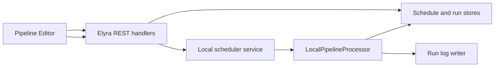

# Local Pipeline Scheduling

Feature Name: local-pipeline-scheduling
Updated: 2026-07-29

## Description

本设计扩展 `LocalPipelineProcessor`，提供由 Jupyter Server 生命周期托管的 Cron 调度。调度定义、运行记录和结构化日志采用 Elyra 元数据目录中的 JSON 文件持久化。每个任务在同一时刻保留一个活动运行，重叠触发形成可查询的 `skipped` 记录。服务恢复后从恢复时刻计算后续触发。

## Architecture



`ElyraApp.initialize_settings()` 创建并启动 `LocalPipelineScheduler`。服务加载任务存储中的启用任务，使用 Cron 计算下一个触发时刻。每次触发由 scheduler 创建运行记录，再通过现有 `PipelineProcessorManager.process()` 调用 Local processor。

## Components and Interfaces

### LocalPipelineScheduler

新模块：`elyra/pipeline/local/scheduler.py`。

- 载入、注册、更新和移除调度任务。
- 使用单个后台调度循环等待最近的触发时刻。
- 为每次触发创建运行记录。
- 通过每个任务的活动运行状态实现单实例策略。
- 在 `ElyraApp.stop_extension()` 停止调度循环并等待运行中的提交操作完成。

### ScheduleStore

新模块：`elyra/pipeline/local/schedule_store.py`。

- 在 Elyra metadata 路径中保存调度任务 JSON。
- 提供任务列表、单任务读取、创建、更新和删除。
- 对每次写入使用临时文件与原子替换，保证 JSON 文件完整性。

任务模型：

```text
LocalSchedule
  id: string
  display_name: string
  pipeline_definition: object
  cron_expression: string
  enabled: boolean
  created_at: ISO-8601 timestamp
  updated_at: ISO-8601 timestamp
  next_run_at: ISO-8601 timestamp
```

### RunStore 和 RunLogWriter

新模块：`elyra/pipeline/local/run_store.py`。

- 保存运行记录与结构化日志。
- 为每个运行使用独立 JSON Lines 日志文件。
- 支持按任务、状态、开始时间分页读取记录。
- 支持按运行标识顺序读取日志。
- 每次写入运行记录时执行保留清理，保留最近 100 条记录和最近 90 天内的记录，并清理被移除记录关联的日志文件。

运行模型：

```text
LocalScheduledRun
  id: string
  schedule_id: string
  status: scheduled | running | succeeded | failed | skipped
  scheduled_at: ISO-8601 timestamp
  started_at: ISO-8601 timestamp
  finished_at: ISO-8601 timestamp
  error_summary: string
  log_path: string
```

日志条目模型：

```text
RunLogEntry
  timestamp: ISO-8601 timestamp
  level: string
  message: string
  operation_name: string
```

### LocalPipelineProcessor

修改 `elyra/pipeline/local/local_processor.py`：

- 增加可选的运行观察者或日志上下文参数。
- 将节点开始、节点完成和节点失败事件发送至 `RunLogWriter`。
- 保留既有的手动本地执行行为与返回类型。

### REST API

新 handler 位于 `elyra/pipeline/local/handlers.py`，并在 `ElyraApp.initialize_handlers()` 注册。

| 方法 | 路径 | 行为 |
| --- | --- | --- |
| `GET` | `/elyra/pipeline/local/schedules` | 列出调度任务 |
| `POST` | `/elyra/pipeline/local/schedules` | 创建调度任务 |
| `GET` | `/elyra/pipeline/local/schedules/{id}` | 获取调度任务 |
| `PUT` | `/elyra/pipeline/local/schedules/{id}` | 更新调度任务 |
| `DELETE` | `/elyra/pipeline/local/schedules/{id}` | 删除调度任务 |
| `GET` | `/elyra/pipeline/local/schedules/{id}/runs` | 查询运行记录 |
| `GET` | `/elyra/pipeline/local/runs/{id}/logs` | 查询运行日志 |

所有创建和更新请求都复用 `PipelineValidationManager` 验证管道定义；创建和更新请求额外验证 Cron 表达式。

### Pipeline Editor

修改 `packages/pipeline-editor`：

- 为 Local 运行时加入“创建调度”命令和表单。
- 在运行时详情中展示任务列表、启用状态、Cron 表达式和下次触发时间。
- 在任务详情中展示运行记录；日志操作打开按运行标识加载的只读日志面板。
- 新建 `LocalScheduleService`，集中管理调度、记录和日志 API 调用。

## Correctness Properties

1. 每个启用调度任务在每个 Cron 命中的触发点最多创建一个运行记录。
2. 每个调度任务同时最多包含一个 `running` 记录。
3. 每个 `running` 记录最终转换为 `succeeded` 或 `failed`。
4. 每个运行日志条目引用一个存在的运行标识。
5. 已持久化且启用的任务在 Jupyter Server 启动完成后拥有下一个触发时刻。
6. 调度定义、运行记录和日志条目可分别序列化和反序列化；反序列化后的内容与写入内容等价。

## Error Handling

- Cron 校验失败返回 HTTP 400 与字段级错误。
- 管道校验失败返回 HTTP 400 与现有 Pipeline Validation issues。
- 存储写入失败返回 HTTP 500，原有完整 JSON 文件保持可读取。
- 调度器运行异常创建 `failed` 记录并保存错误摘要。
- 本地处理器节点异常创建 `failed` 记录并写入异常日志。
- 已删除任务的后续调度回调在执行前确认任务存在与启用状态。

## Test Strategy

- 为 Cron 校验、下次触发时间和恢复后触发计算添加单元测试。
- 为任务 CRUD、原子存储与 JSON 往返添加单元测试。
- 为单实例策略和 `skipped` 运行记录添加并发测试。
- 为成功、失败和节点级日志写入添加 LocalPipelineProcessor 测试。
- 为调度、记录和日志 API 添加 Tornado handler 测试。
- 为 Pipeline Editor 创建、启用、查看历史和打开日志添加 Jest 测试。
- 使用 Cypress 验证从 Pipeline Editor 创建 Local Cron 任务到查看结果日志的完整流程。

## References

[^1]: `elyra/elyra_app.py:125` - Jupyter Server 生命周期与服务初始化。
[^2]: `elyra/pipeline/local/local_processor.py:41` - 本地管道处理器。
[^3]: `elyra/pipeline/handlers.py:133` - 现有管道提交与验证路径。
[^4]: `packages/pipeline-editor/src/PipelineService.tsx:208` - 前端提交请求。
