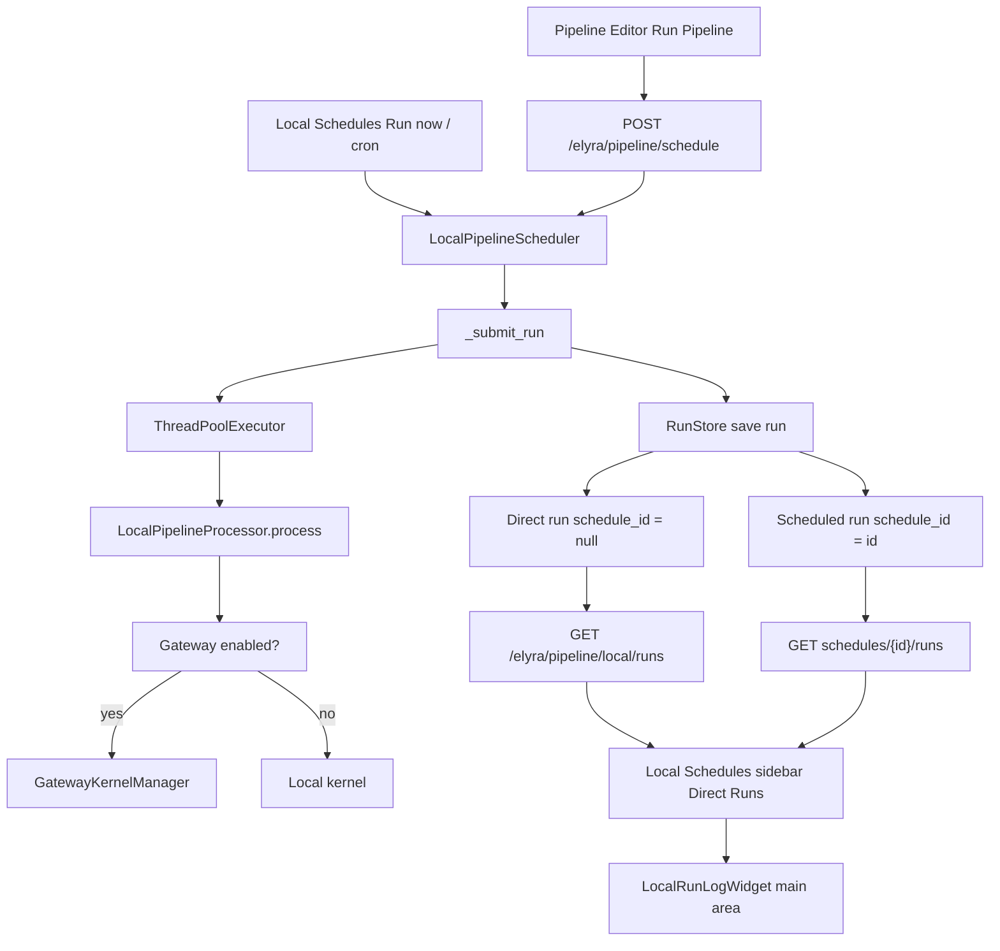

# Local Run History and Gateway Execution

Feature Name: local-run-history-and-gateway
Updated: 2026-07-31

## Description

Record pipeline runs started directly from the Pipeline Editor in the same
`RunStore` used by local schedules, expose them in the Local Schedules sidebar
under a "Direct Runs" entry, render each run log as a main-area document, and
ensure scheduled and direct runs share the Enterprise Gateway kernel path.

## Architecture

## Components and Interfaces

### Backend

- `elyra/pipeline/handlers.py` `PipelineSchedulerHandler.post` — when
  `pipeline.runtime == "local"`, calls
  `LocalPipelineScheduler.submit_direct` and returns the run dict with HTTP
  202 instead of executing synchronously through
  `PipelineProcessorManager.process`.
- `elyra/pipeline/local/scheduler.py` `submit_direct` — builds a transient
  `LocalSchedule` carrying the pipeline definition and a `max_attempts=1`
  retry policy, then submits it via `_submit_run(..., persist_schedule=False)`
  so the run is stored with `schedule_id=None` and `trigger_type="direct"`.
- `elyra/pipeline/local/scheduler.py` `_submit_run` — gains the
  `persist_schedule` flag and a run-id to schedule-id map used to release the
  concurrency slot for direct runs whose persisted schedule is `null`.
- `elyra/pipeline/local/models.py` `LocalScheduledRun` — `schedule_id`
  becomes `Optional[str]`, `VALID_TRIGGER_TYPES` includes `direct`, and
  `from_dict` tolerates a missing `schedule_id`.
- `elyra/pipeline/local/run_store.py` `list` — accepts `direct_only=True` to
  filter runs whose `schedule_id` is `None`.
- `elyra/pipeline/local/handlers.py` `LocalDirectRunsHandler` — exposes
  `GET /elyra/pipeline/local/runs` returning only direct runs for the
  authenticated owner.
- `elyra/elyra_app.py` — registers the new route ahead of the run-id
  routes.

### Frontend

- `packages/pipeline-editor/src/LocalScheduleService.ts` —
  `ILocalScheduledRun.schedule_id` and `trigger_type` widen to include
  `null` and `direct`; adds `listDirectRuns()` calling the new endpoint.
- `packages/pipeline-editor/src/LocalSchedulesWidget.tsx` —
  `LocalSchedulesPanel` selects a fixed "Direct Runs" entry, loads direct
  runs, hides schedule-specific actions (edit, run now, enable, delete) and
  retry when no schedule is selected, displays `remote_kernel_id` when
  present, and invokes the `onOpenLogs` callback when a run log is loaded.
  `LocalRunLogWidget` renders the log as plain text in the main area and
  refreshes via `setLogs`.
- `packages/pipeline-editor/src/index.ts` — wires `onOpenLogs` to open (or
  refresh) a `LocalRunLogWidget` in the main area and sets the sidebar icon
  to `pipelineIcon`.
- `packages/pipeline-editor/src/PipelineService.tsx` —
  `IPipelineScheduleResponse` makes remote fields optional and adds
  `trigger_type`; direct submissions notify the sidebar to refresh and show
  a background-execution dialog.

## Data Models

- `LocalScheduledRun.schedule_id: Optional[str]`
- `LocalScheduledRun.trigger_type` adds `"direct"`.
- `RunStore.list(..., direct_only=False)` filters on `schedule_id is None`.
- Transient schedule for direct runs: `RetryPolicy(max_attempts=1,
  initial_delay_seconds=0, backoff_multiplier=1)`; never persisted in
  `ScheduleStore`.

## Correctness Properties

1. A persisted direct run always has `schedule_id is None` and
   `trigger_type == "direct"`.
2. Direct runs never enqueue automatic retries because `attempt_number` (1)
   exceeds `max_attempts - 1` (0).
3. Concurrency slots for direct runs are released exactly once per run via
   the run-id to schedule-id map, even though their schedule id is not
   persisted.
4. Listing direct runs is owner-scoped, matching schedule-scoped run listing.

## Error Handling

- `submit_direct` preserves the scheduler's existing error capture: failures
  record `error_summary`, append an `ERROR` log entry, and mark the run
  `failed` without retry.
- `GET /elyra/pipeline/local/runs` returns an empty list when no direct runs
  exist for the owner.

## Test Strategy

- Backend: `elyra/tests/pipeline/local/test_scheduler.py` asserts that a
  direct run is executed, recorded with the expected fields, and listed only
  via `direct_only`. `test_handlers.py` asserts the `LocalDirectRunsHandler`
  returns only `schedule_id is None` runs for the caller.
- Frontend: `src/test/local-schedule-service.spec.ts` covers
  `listDirectRuns`, the "Direct Runs" selection flow, the gateway kernel
  display, and `LocalRunLogWidget` rendering.
- Existing schedule and retry tests remain green to confirm no regression
  for persisted schedules.
