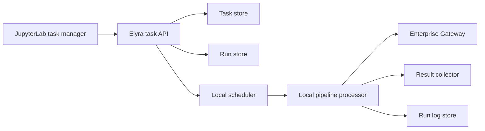

# Pipeline Task Management

Feature Name: pipeline-task-management
Updated: 2026-07-30

## Description

本设计在现有 Local Pipeline Scheduling 基础上增加完整任务管理。调度任务归属于 Jupyter 用户，每次手动运行、计划触发或重试生成独立运行实例。Local Pipeline 继续由 Jupyter Server 调度；Notebook 节点配置 Enterprise Gateway 时，Elyra 记录远程 Kernel 标识和远程执行状态。

## Architecture



`ElyraApp` 启动时初始化用户范围内的任务调度服务。服务读取持久化任务、计算计划触发并写入运行实例。失败实例按重试策略排队；Notebook 操作启用 Enterprise Gateway 时，处理器记录远程 Kernel 信息。任务管理 API 为前端提供任务、实例、日志和输出结果的读取与控制能力。

## Components and Interfaces

### Task Definition and Schedule

扩展 `LocalSchedule` 为可管理任务定义，并增加以下字段：

```text
ManagedTask
  id: string
  owner_id: string
  display_name: string
  pipeline_definition: object
  cron_expression: string | null
  enabled: boolean
  retry_policy: RetryPolicy
  created_at: ISO-8601 timestamp
  updated_at: ISO-8601 timestamp
  next_run_at: ISO-8601 timestamp | null

RetryPolicy
  max_attempts: integer = 3
  initial_delay_seconds: integer = 60
  backoff_multiplier: number = 2
```

任务创建与编辑表单提供最大尝试次数、初始重试间隔和退避倍率。用户未填写字段时采用默认值。`ScheduleStore` 演进为用户隔离的任务存储。任务 API 的认证用户标识作为存储分区键；所有任务读取、更新和删除都验证归属关系。

### Run Lifecycle

扩展 `LocalScheduledRun`，使其承载手动、计划和重试触发：

```text
ManagedRun
  id: string
  task_id: string
  owner_id: string
  trigger_type: manual | scheduled | retry
  attempt_number: integer
  parent_run_id: string | null
  status: queued | running | retrying | succeeded | failed | stopped | skipped
  scheduled_at: ISO-8601 timestamp
  started_at: ISO-8601 timestamp | null
  finished_at: ISO-8601 timestamp | null
  error_summary: string | null
  remote_kernel_id: string | null
  log_path: string
```

状态转换为：`queued` 到 `running`，`running` 到 `succeeded`、`failed` 或 `stopped`，`failed` 到 `retrying`，`retrying` 到新的 `queued` 实例。每次重试保留父运行实例标识和尝试序号。

### Retry Coordinator

`LocalPipelineScheduler` 增加重试队列。失败实例的延迟由以下公式计算：

```text
delay = initial_delay_seconds * backoff_multiplier^(attempt_number - 1)
```

协调器只为剩余尝试次数内的失败实例创建重试。手动重试创建新的尝试链，并复用原始 Pipeline 定义和参数。活动运行的停止请求通过 `LocalPipelineProcessor` 传播到当前 Notebook 操作；远程 Kernel 存在时由 Gateway 客户端请求停止 Kernel。

### Output Result Collector

处理器在每个操作完成后收集可访问输出结果，并将结果元数据与运行实例关联：

```text
RunResult
  id: string
  run_id: string
  operation_name: string | null
  kind: notebook | file | remote_kernel | link
  location: string
  display_name: string
  created_at: ISO-8601 timestamp
```

Notebook 结果包含已执行 Notebook 路径。远程 Kernel 结果包含 Kernel 标识和 Gateway 提供的可访问引用。文件结果包含工作区相对路径。

### REST API

现有 Local Schedule API 保持兼容。新增统一任务管理端点：

| Method | Path | Behavior |
| --- | --- | --- |
| `GET` | `/elyra/pipeline/local/tasks` | List user tasks with filters |
| `GET` | `/elyra/pipeline/local/tasks/{id}` | Read one user task |
| `POST` | `/elyra/pipeline/local/tasks/{id}/runs` | Create a manual run |
| `GET` | `/elyra/pipeline/local/tasks/{id}/runs` | List task runs |
| `GET` | `/elyra/pipeline/local/runs/{id}` | Read run details |
| `POST` | `/elyra/pipeline/local/runs/{id}/retry` | Create manual retry |
| `POST` | `/elyra/pipeline/local/runs/{id}/stop` | Stop active run |
| `GET` | `/elyra/pipeline/local/runs/{id}/results` | List output results |
| `DELETE` | `/elyra/pipeline/local/runs/{id}` | Delete local run metadata |

所有端点使用 Jupyter Server 认证上下文定位用户存储分区。活动任务、计划与运行实例的变更以原子写入方式保存。

### JupyterLab Task Manager

在 `packages/pipeline-editor` 中将现有 `LocalSchedulesWidget` 演进为任务管理侧栏：

- 任务列表提供运行时、计划、最近状态、下次执行时间和筛选条件。
- 任务详情提供启用、编辑、删除和手动运行操作。
- 运行详情提供状态时间线、尝试链、停止、重试、日志与结果标签页。
- 本地运行和 Enterprise Gateway Notebook 运行共用相同任务详情视图；远程 Kernel 信息显示为运行元数据。

## Correctness Properties

1. 每个任务和运行实例只属于一个 Jupyter 用户。
2. 用户查询、修改或删除操作只处理相同用户标识关联的管理记录。
3. 每个运行实例具有唯一尝试序号和可追溯的重试父运行标识。
4. 自动重试次数不超过任务定义中的最大尝试次数。
5. 每个终态运行实例保留状态、时间和错误摘要。
6. 每个输出结果引用存在的运行实例。
7. Enterprise Gateway Kernel 标识只关联启动该 Kernel 的运行实例。

## Error Handling

- 最大尝试次数小于一、初始重试间隔小于零或退避倍率小于一时，Elyra 返回 HTTP 400 与字段级错误。
- 任务或运行实例归属不匹配返回 HTTP 404。
- Enterprise Gateway Kernel 创建、连接或停止失败写入运行日志和错误摘要。
- 输出结果采集失败写入警告日志，运行实例保持原执行终态。
- 任务存储写入失败返回 HTTP 500，原有持久化文件保持可读取状态。
- 服务恢复时，将中断的活动运行标记为失败并按策略创建后续重试。

## Test Strategy

- 为重试延迟、最大尝试次数和手动重试链添加调度器单元测试。
- 为用户隔离、任务 CRUD、运行控制和结果查询添加 API handler 测试。
- 为 Local Notebook 和 Enterprise Gateway Notebook 执行元数据添加处理器测试。
- 为停止、重试、删除、日志与结果面板添加 Jest 测试。
- 使用 Cypress 覆盖创建计划、失败重试、查看日志、查看结果和删除管理记录的完整流程。

## References

[^1]: `elyra/elyra_app.py:146` - Local scheduler lifecycle.
[^2]: `elyra/pipeline/local/scheduler.py:41` - Existing local task scheduling.
[^3]: `elyra/pipeline/local/local_processor.py:229` - Enterprise Gateway notebook execution.
[^4]: `elyra/pipeline/local/handlers.py:90` - Existing schedule management API.
[^5]: `packages/pipeline-editor/src/LocalSchedulesWidget.tsx:37` - Existing JupyterLab schedule panel.
